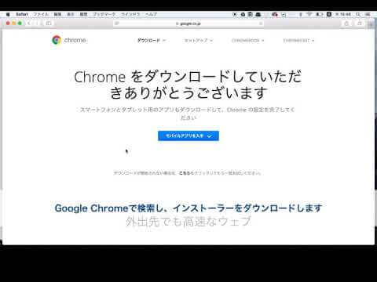

# 事前学習の準備
このカリキュラムでは、これから事前学習するにあたり最低限必要なソフトのインストールをします。
インストールするソフトは以下の3つです。

必要なソフトは以下の通りです。

1. Google chrome
2. Visual studio code

## インストール手順
・Google Chrome

MacにはSafari、WindowsにはIEまたはEdgeがデフォルトのブラウザとして用意されていますが、
ブラウザには、開発者用の様々な機能が付いているGoogle Chromeがオススメです。

公式からダウンロードしましょう。

ダウンロードリンク
https://www.google.co.jp/chrome/index.html

・Visual Studio Code

コードを書くためには、テキストエディタというプログラムのソースコードを編集するためのツールが必要です。
現役のエンジニアやデザイナーが現場でよくつかっているVisual Studio Codeを利用してプログラミングを進めていきます。

ダウンロードリンク
https://code.visualstudio.com/download

ダウンロード&インストール手順
公式サイトからインストーラをダウンロードします。
MacとWindowsでダウンロードするファイルが異なりますのでご注意ください。
ダウンロードしたファイル(インストーラー)をダブルクリックして開き、インストールを進めます。
インストールが完了したら、Visual Studio Codeが起動することを確認してください。